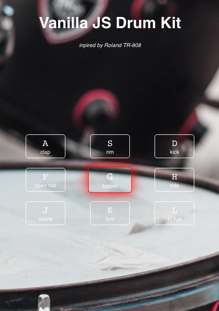

# Vanilla JS Drum Kit
_inspired by ROLAND TR-808_

## [Check out demo!](https://mmazurkiewicz.github.io/Vanilla-JS-Drum-Kit/)

### Features:

* 9 different drum sounds
* Clear design

### Made with:
* HTML
* CSS
* Vanilla JS
* ES 6

_background downloaded from unsplash.com_

_this is a first challange from JavaScript30 | https://javascript30.com/_
___

License
----

MIT
